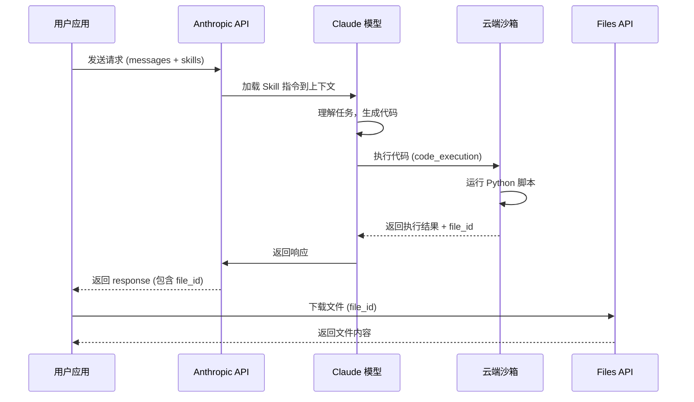
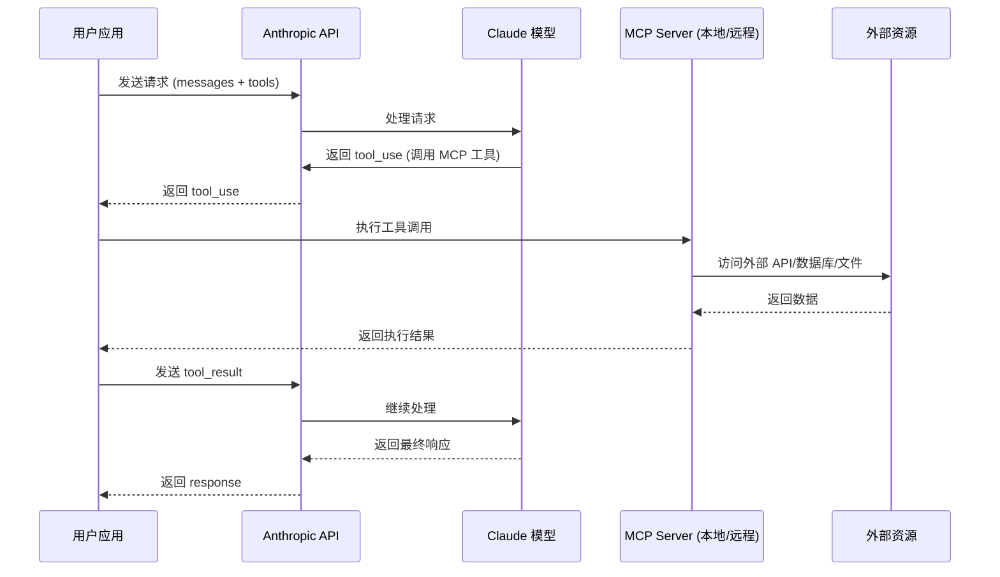
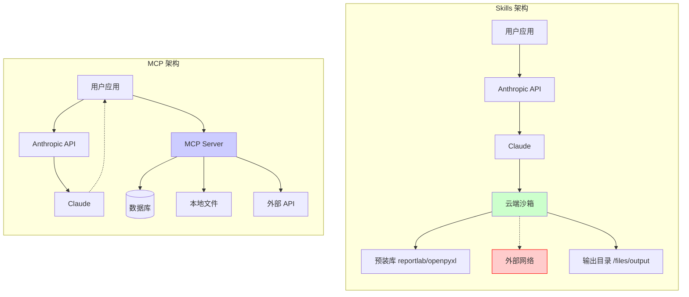

# Claude Skills API 深度解析：与 MCP 的对比及实战指南

> 本文深入解析 Anthropic 新推出的 Skills API，对比 MCP（Model Context Protocol），并提供完整的实战示例和自定义 Skill 开发指南。

## 前言

2025 年，Anthropic 推出了 Skills API（目前处于 Beta 阶段），这是一种让 Claude 能够执行特定任务的能力扩展方式。很多开发者会问：这和 MCP 有什么区别？什么时候该用 Skills，什么时候该用 MCP？

本文将从实战角度，全面解答这些问题。

---

## 一、Skills vs MCP：核心差异

### 什么是 Skills？

**Skills** 是 Anthropic 官方提供的预置能力包，运行在 Claude 的云端沙箱环境中。你可以把它理解为"Claude 原生就会的技能"。

### 什么是 MCP？

**MCP（Model Context Protocol）** 是一个开放协议，允许你在本地或远程运行服务器，为 Claude 提供自定义工具和数据源。

### 执行逻辑对比

在深入对比之前，让我们先看看两者的执行流程有什么不同。

#### Skills 执行流程

Skills 的所有代码执行都发生在 Anthropic 的云端沙箱中，用户应用只需要发起 API 调用并接收结果。



**特点：**
- 代码在云端沙箱执行，与用户环境完全隔离
- 无法访问外部网络和本地资源
- 文件通过 Files API 异步下载

#### MCP 执行流程

MCP 需要用户自行部署服务器，Claude 通过工具调用与服务器交互。



**特点：**
- 工具在用户控制的服务器上执行
- 可以访问任意外部资源
- 需要用户应用处理工具调用的中转

#### 架构对比图



> 注：红色节点表示 Skills 无法访问外部网络

### 对比表格

| 特性 | Skills | MCP |
|------|--------|-----|
| **运行环境** | Anthropic 云端沙箱 | 本地/自托管服务器 |
| **延迟** | 较低（云端直接执行） | 取决于服务器位置 |
| **安全性** | 沙箱隔离，无法访问外部 | 可访问本地资源，需自行保障安全 |
| **灵活性** | 受限于沙箱环境 | 几乎无限制 |
| **依赖管理** | 预装库（reportlab, openpyxl 等） | 自行管理 |
| **调用外部 API** | ❌ 不支持 | ✅ 支持 |
| **访问本地文件** | ❌ 不支持 | ✅ 支持 |
| **部署复杂度** | 零部署（即用即得） | 需要搭建服务器 |
| **版本管理** | 官方维护 + 自定义版本 | 自行维护 |

### 选择建议

**选 Skills 的场景：**
- 生成 Office 文档（Word、Excel、PPT、PDF）
- 数据处理和可视化
- 不需要访问外部资源的任务
- 追求简单、开箱即用

**选 MCP 的场景：**
- 需要调用外部 API（如 Gemini、OpenAI）
- 需要访问本地文件系统
- 需要连接数据库
- 需要自定义复杂业务逻辑
- 企业内网部署场景

### Skills 的优势

1. **零配置**：无需搭建服务器，API 调用即可使用
2. **安全沙箱**：代码在隔离环境运行，不会影响你的系统
3. **预装依赖**：常用 Python 库已就绪，无需安装
4. **一致性**：官方维护，版本稳定

### Skills 的局限

1. **无法联网**：沙箱环境无法访问外部 API
2. **依赖受限**：只能使用预装的库
3. **存储限制**：文件只能输出到指定目录
4. **自定义成本**：自定义 Skill 需要上传到 Anthropic

### MCP 的优势

1. **完全自主**：代码运行在你自己的服务器上，完全可控
2. **无限灵活**：可以调用任何外部 API、访问任何资源
3. **本地集成**：可以直接操作本地文件、数据库
4. **生态丰富**：社区已有大量现成的 MCP Server 可用

### MCP 的局限

1. **部署成本**：需要自行搭建和维护 MCP Server
2. **安全风险**：服务器可访问外部资源，需自行保障安全
3. **网络依赖**：本地服务器需要保持运行，远程服务器有延迟
4. **开发成本**：需要编写服务器代码，遵循 MCP 协议
5. **调试复杂**：涉及多个组件（Client → API → Server），排查问题较困难

### MCP 代码示例

下面是一个简单的 MCP Server 示例，提供天气查询功能：

**server.py - MCP Server 实现**

```python
"""
MCP Server 示例：天气查询服务
"""
import json
import httpx
from mcp.server import Server
from mcp.types import Tool, TextContent

app = Server("weather-server")

@app.list_tools()
async def list_tools():
    """定义可用的工具"""
    return [
        Tool(
            name="get_weather",
            description="获取指定城市的天气信息",
            inputSchema={
                "type": "object",
                "properties": {
                    "city": {
                        "type": "string",
                        "description": "城市名称，如 Beijing, Shanghai"
                    }
                },
                "required": ["city"]
            }
        )
    ]

@app.call_tool()
async def call_tool(name: str, arguments: dict):
    """执行工具调用"""
    if name == "get_weather":
        city = arguments.get("city")
        # 调用外部天气 API（这在 Skills 中无法实现！）
        async with httpx.AsyncClient() as client:
            response = await client.get(
                f"https://api.weatherapi.com/v1/current.json",
                params={"key": "YOUR_API_KEY", "q": city}
            )
            data = response.json()

        return [TextContent(
            type="text",
            text=json.dumps({
                "city": city,
                "temperature": data["current"]["temp_c"],
                "condition": data["current"]["condition"]["text"]
            }, ensure_ascii=False)
        )]

if __name__ == "__main__":
    import asyncio
    from mcp.server.stdio import stdio_server

    asyncio.run(stdio_server(app))
```

**client.py - 使用 MCP Server**

```python
"""
MCP Client 示例：调用天气查询服务
"""
from anthropic import Anthropic

client = Anthropic()

# MCP 工具定义（与 Server 中的 list_tools 对应）
tools = [
    {
        "name": "get_weather",
        "description": "获取指定城市的天气信息",
        "input_schema": {
            "type": "object",
            "properties": {
                "city": {
                    "type": "string",
                    "description": "城市名称"
                }
            },
            "required": ["city"]
        }
    }
]

def chat_with_mcp(user_message: str):
    """使用 MCP 工具进行对话"""
    messages = [{"role": "user", "content": user_message}]

    # 第一次调用：Claude 决定是否使用工具
    response = client.messages.create(
        model="claude-sonnet-4-20250514",
        max_tokens=1024,
        tools=tools,
        messages=messages,
    )

    # 检查是否需要调用工具
    if response.stop_reason == "tool_use":
        # 提取工具调用
        tool_use = next(
            block for block in response.content
            if block.type == "tool_use"
        )

        print(f"调用工具: {tool_use.name}")
        print(f"参数: {tool_use.input}")

        # 这里需要实际调用 MCP Server
        # 简化示例：直接模拟返回结果
        tool_result = {
            "city": tool_use.input["city"],
            "temperature": 22,
            "condition": "晴天"
        }

        # 第二次调用：将工具结果返回给 Claude
        messages.append({"role": "assistant", "content": response.content})
        messages.append({
            "role": "user",
            "content": [{
                "type": "tool_result",
                "tool_use_id": tool_use.id,
                "content": str(tool_result)
            }]
        })

        response = client.messages.create(
            model="claude-sonnet-4-20250514",
            max_tokens=1024,
            tools=tools,
            messages=messages,
        )

    # 返回最终文本响应
    return response.content[0].text


if __name__ == "__main__":
    result = chat_with_mcp("北京今天天气怎么样？")
    print(f"Claude: {result}")
```

**对比：同样的功能用 Skills 无法实现**

```python
# ❌ Skills 无法做到：调用外部 API
# 因为沙箱环境没有网络访问权限

# ✅ Skills 能做到：生成文件
# 使用预装的库在沙箱内处理数据
```

---

## 二、官方 Skills 实战演示

Skills API 需要启用以下 Beta 功能：

```python
BETAS = [
    "code-execution-2025-08-25",  # 代码执行
    "skills-2025-10-02",          # Skills 功能
    "files-api-2025-04-14",       # 文件下载
]
```

### 2.1 PowerPoint 生成 (pptx)

创建专业演示文稿：

```python
from dotenv import load_dotenv
from anthropic import Anthropic

load_dotenv()
client = Anthropic()

BETAS = [
    "code-execution-2025-08-25",
    "skills-2025-10-02",
    "files-api-2025-04-14",
]

def create_presentation():
    """使用 pptx skill 创建 PowerPoint 演示文稿"""

    response = client.beta.messages.create(
        model="claude-3-7-sonnet-20250219",
        max_tokens=16000,
        betas=BETAS,
        container={
            "skills": [
                {"type": "anthropic", "skill_id": "pptx", "version": "latest"}
            ]
        },
        tools=[
            {"type": "code_execution_20250825", "name": "code_execution"}
        ],
        messages=[
            {
                "role": "user",
                "content": """创建一个关于 "AI 发展趋势" 的 PowerPoint 演示文稿：

                幻灯片 1: 标题页
                - 标题: AI 发展趋势 2025
                - 副标题: 技术前沿洞察

                幻灯片 2: 目录
                - 大模型进展
                - 多模态融合
                - Agent 生态
                """
            }
        ],
    )

    # 提取并下载文件
    for block in response.content:
        if hasattr(block, "content") and hasattr(block.content, "content"):
            inner_content = block.content.content
            if isinstance(inner_content, list):
                for item in inner_content:
                    if hasattr(item, "file_id") and item.file_id:
                        file_content = client.beta.files.download(
                            file_id=item.file_id,
                            betas=["files-api-2025-04-14"]
                        )
                        file_content.write_to_file("output.pptx")
                        print("✅ 文件已保存: output.pptx")

if __name__ == "__main__":
    create_presentation()
```

### 2.2 Excel 报表生成 (xlsx)

创建带公式的销售报表：

```python
def create_excel_report():
    """使用 xlsx skill 创建 Excel 报表"""

    messages = [
        {
            "role": "user",
            "content": """创建一个 Excel 销售报表，包含：
            1. 第一个工作表 "销售数据"：
               - 列：产品名称、数量、单价、总额
               - 5行示例数据
               - 总额列使用公式计算 (数量 * 单价)
               - 最后一行显示总计

            2. 第二个工作表 "统计"：
               - 显示总销售额
               - 显示平均单价
               - 使用公式引用第一个工作表的数据
            """
        }
    ]

    # Agentic loop: 持续处理直到任务完成
    while True:
        response = client.beta.messages.create(
            model="claude-3-7-sonnet-20250219",
            max_tokens=16000,
            betas=BETAS,
            container={
                "skills": [
                    {"type": "anthropic", "skill_id": "xlsx", "version": "latest"}
                ]
            },
            tools=[
                {"type": "code_execution_20250825", "name": "code_execution"}
            ],
            messages=messages,
        )

        # 处理响应并下载文件
        for block in response.content:
            if hasattr(block, "content") and hasattr(block.content, "content"):
                inner_content = block.content.content
                if isinstance(inner_content, list):
                    for item in inner_content:
                        if hasattr(item, "file_id") and item.file_id:
                            file_content = client.beta.files.download(
                                file_id=item.file_id,
                                betas=["files-api-2025-04-14"]
                            )
                            file_content.write_to_file("sales_report.xlsx")
                            print("✅ Excel 文件已保存: sales_report.xlsx")

        if response.stop_reason == "end_turn":
            break

        messages.append({"role": "assistant", "content": response.content})
        messages.append({"role": "user", "content": [{"type": "text", "text": "继续"}]})

    return response
```

### 2.3 Word 文档生成 (docx)

创建格式化的项目提案：

```python
def create_document():
    """使用 docx skill 创建 Word 文档"""

    messages = [
        {
            "role": "user",
            "content": """创建一份项目提案文档，包含：

            1. 标题: "智能客服系统项目提案"

            2. 项目背景 (一段描述)

            3. 项目目标 (列表形式):
               - 提升客户满意度
               - 降低人工成本
               - 24小时服务覆盖

            4. 项目里程碑 (表格形式):
               | 阶段 | 时间 | 交付物 |
               | 需求分析 | 2周 | 需求文档 |
               | 系统设计 | 3周 | 设计文档 |
               | 开发测试 | 8周 | 系统原型 |

            请使用专业的文档格式。
            """
        }
    ]

    while True:
        response = client.beta.messages.create(
            model="claude-3-7-sonnet-20250219",
            max_tokens=16000,
            betas=BETAS,
            container={
                "skills": [
                    {"type": "anthropic", "skill_id": "docx", "version": "latest"}
                ]
            },
            tools=[
                {"type": "code_execution_20250825", "name": "code_execution"}
            ],
            messages=messages,
        )

        for block in response.content:
            if hasattr(block, "content") and hasattr(block.content, "content"):
                inner_content = block.content.content
                if isinstance(inner_content, list):
                    for item in inner_content:
                        if hasattr(item, "file_id") and item.file_id:
                            file_content = client.beta.files.download(
                                file_id=item.file_id,
                                betas=["files-api-2025-04-14"]
                            )
                            file_content.write_to_file("project_proposal.docx")
                            print("✅ Word 文件已保存: project_proposal.docx")

        if response.stop_reason == "end_turn":
            break

        messages.append({"role": "assistant", "content": response.content})
        messages.append({"role": "user", "content": [{"type": "text", "text": "继续"}]})
```

### 2.4 PDF 报告生成 (pdf)

创建专业的月度报告：

```python
def create_pdf_report():
    """使用 pdf skill 创建 PDF 报告"""

    messages = [
        {
            "role": "user",
            "content": """创建一份 PDF 格式的月度报告：

            标题: 2025年11月运营报告

            1. 执行摘要
               - 本月核心指标概览
               - 关键成就

            2. 业务数据
               - 用户增长: 15%
               - 收入增长: 22%
               - 客户满意度: 4.5/5

            3. 重点项目进展
               - 项目A: 已完成 80%
               - 项目B: 已完成 60%

            4. 下月计划

            请使用专业的 PDF 格式，包含页眉页脚。
            """
        }
    ]

    while True:
        response = client.beta.messages.create(
            model="claude-3-7-sonnet-20250219",
            max_tokens=16000,
            betas=BETAS,
            container={
                "skills": [
                    {"type": "anthropic", "skill_id": "pdf", "version": "latest"}
                ]
            },
            tools=[
                {"type": "code_execution_20250825", "name": "code_execution"}
            ],
            messages=messages,
        )

        for block in response.content:
            if hasattr(block, "content") and hasattr(block.content, "content"):
                inner_content = block.content.content
                if isinstance(inner_content, list):
                    for item in inner_content:
                        if hasattr(item, "file_id") and item.file_id:
                            file_content = client.beta.files.download(
                                file_id=item.file_id,
                                betas=["files-api-2025-04-14"]
                            )
                            file_content.write_to_file("monthly_report.pdf")
                            print("✅ PDF 文件已保存: monthly_report.pdf")

        if response.stop_reason == "end_turn":
            break

        messages.append({"role": "assistant", "content": response.content})
        messages.append({"role": "user", "content": [{"type": "text", "text": "继续"}]})
```

---

## 三、自定义 Skills 开发

除了官方预置的 Skills，你还可以创建自己的 Custom Skills。下面以"简历生成器"为例，展示完整的开发流程。

### 3.1 Skill 结构

一个自定义 Skill 是一个文件夹，必须包含 `SKILL.md` 文件：

```
custom_skills/
└── resume-gen/
    ├── SKILL.md           # Skill 定义文件（必须）
    └── generate_resume.py # 功能脚本
```

### 3.2 SKILL.md 文件

```markdown
---
name: resume-gen
description: |
  Use this skill to generate professional resume/CV PDFs based on user information.
  Triggers: user asks to "create a resume", "generate CV", "make a resume",
  "help me with my resume", or provides personal/professional information for a resume.
  Capabilities: Creates beautifully formatted PDF resumes with sections for
  contact info, summary, work experience, education, skills, projects, and more.
  Supports multiple styles: modern, classic, minimal.
---

# Resume Generator Skill

## Overview

This skill generates professional PDF resumes using ReportLab.

## Available Styles

1. **modern** - Clean design with accent colors
2. **classic** - Traditional format, formal
3. **minimal** - Simple, lots of white space

## How to Use

### Step 1: Create the Data File

```python
import json

resume_data = {
    "style": "modern",
    "header": {
        "name": "张三",
        "title": "高级软件工程师",
        "email": "zhangsan@example.com",
        "phone": "+86 138-0000-0000",
        "location": "北京市"
    },
    "summary": "拥有8年软件开发经验的全栈工程师...",
    "experience": [...],
    "education": [...],
    "skills": {...}
}

with open('/tmp/resume_data.json', 'w', encoding='utf-8') as f:
    json.dump(resume_data, f, ensure_ascii=False, indent=2)
```

### Step 2: Generate the Resume

```bash
python /skills/resume-gen/generate_resume.py /tmp/resume_data.json /files/output/resume.pdf
```
```

### 3.3 功能脚本 generate_resume.py

```python
#!/usr/bin/env python3
"""
Resume PDF Generator using ReportLab
Supports multiple styles: modern, classic, minimal
"""
import sys
import json
from pathlib import Path
from reportlab.lib import colors
from reportlab.lib.pagesizes import A4
from reportlab.lib.styles import getSampleStyleSheet, ParagraphStyle
from reportlab.lib.units import mm, cm
from reportlab.platypus import (
    SimpleDocTemplate, Paragraph, Spacer, Table, TableStyle, HRFlowable
)
from reportlab.lib.enums import TA_LEFT, TA_CENTER, TA_RIGHT
from reportlab.pdfbase import pdfmetrics
from reportlab.pdfbase.ttfonts import TTFont

# 中文字体支持
CHINESE_FONT = 'Helvetica'
FONT_PATHS = [
    '/usr/share/fonts/truetype/wqy/wqy-zenhei.ttc',
    '/usr/share/fonts/opentype/noto/NotoSansCJK-Regular.ttc',
    '/usr/share/fonts/truetype/noto/NotoSansCJK-Regular.ttc',
]

for font_path in FONT_PATHS:
    if Path(font_path).exists():
        try:
            pdfmetrics.registerFont(TTFont('ChineseFont', font_path))
            CHINESE_FONT = 'ChineseFont'
            break
        except Exception:
            continue

# 样式配置
STYLES = {
    'modern': {
        'primary': colors.HexColor('#2563eb'),
        'secondary': colors.HexColor('#1e40af'),
        'text': colors.HexColor('#1f2937'),
        'light': colors.HexColor('#6b7280'),
    },
    'classic': {
        'primary': colors.HexColor('#1f2937'),
        'secondary': colors.HexColor('#374151'),
        'text': colors.HexColor('#111827'),
        'light': colors.HexColor('#6b7280'),
    },
    'minimal': {
        'primary': colors.HexColor('#000000'),
        'secondary': colors.HexColor('#333333'),
        'text': colors.HexColor('#000000'),
        'light': colors.HexColor('#666666'),
    }
}


class ResumeGenerator:
    def __init__(self, data: dict, style: str = 'modern'):
        self.data = data
        self.style_name = style
        self.colors = STYLES.get(style, STYLES['modern'])
        self.elements = []
        self._setup_styles()

    def _setup_styles(self):
        """设置段落样式"""
        self.styles = getSampleStyleSheet()

        self.styles.add(ParagraphStyle(
            'Name',
            fontName=CHINESE_FONT,
            fontSize=24,
            textColor=self.colors['primary'],
            spaceAfter=2*mm,
            alignment=TA_CENTER if self.style_name == 'modern' else TA_LEFT,
        ))
        # ... 更多样式定义

    def generate(self, output_path: str):
        """生成 PDF"""
        doc = SimpleDocTemplate(
            output_path,
            pagesize=A4,
            rightMargin=2*cm,
            leftMargin=2*cm,
            topMargin=1.5*cm,
            bottomMargin=1.5*cm
        )

        # 构建内容
        self._add_header()
        self._add_summary()
        self._add_experience()
        self._add_education()
        self._add_skills()

        doc.build(self.elements)
        return output_path


def main():
    if len(sys.argv) < 3:
        print("Usage: python generate_resume.py <data.json> <output.pdf>")
        sys.exit(1)

    with open(sys.argv[1], 'r', encoding='utf-8') as f:
        data = json.load(f)

    generator = ResumeGenerator(data, data.get('style', 'modern'))
    generator.generate(sys.argv[2])
    print(f"Resume generated: {sys.argv[2]}")


if __name__ == "__main__":
    main()
```

### 3.4 上传自定义 Skill

```python
"""
上传/更新自定义 Skill 到 Anthropic API
"""
import os
import requests
from pathlib import Path
from dotenv import load_dotenv

load_dotenv()

API_KEY = os.environ.get("ANTHROPIC_API_KEY")
BASE_URL = "https://api.anthropic.com/v1/skills"


def upload_skill(skill_dir: str, display_title: str) -> dict:
    """上传新的自定义 Skill"""
    skill_path = Path(skill_dir)

    files_to_upload = []
    for file_path in skill_path.rglob("*"):
        if file_path.is_file():
            relative_path = file_path.relative_to(skill_path.parent)
            files_to_upload.append(
                ("files[]", (str(relative_path), open(file_path, "rb")))
            )

    headers = {
        "x-api-key": API_KEY,
        "anthropic-version": "2023-06-01",
        "anthropic-beta": "skills-2025-10-02",
    }

    response = requests.post(
        BASE_URL,
        headers=headers,
        data={"display_title": display_title},
        files=files_to_upload,
    )

    for _, (_, f) in files_to_upload:
        f.close()

    response.raise_for_status()
    return response.json()


def update_skill(skill_id: str, skill_dir: str) -> dict:
    """更新已有的 Skill（创建新版本）"""
    skill_path = Path(skill_dir)

    files_to_upload = []
    for file_path in skill_path.rglob("*"):
        if file_path.is_file():
            relative_path = file_path.relative_to(skill_path.parent)
            files_to_upload.append(
                ("files[]", (str(relative_path), open(file_path, "rb")))
            )

    headers = {
        "x-api-key": API_KEY,
        "anthropic-version": "2023-06-01",
        "anthropic-beta": "skills-2025-10-02",
    }

    # POST 到 /versions 创建新版本
    response = requests.post(
        f"{BASE_URL}/{skill_id}/versions",
        headers=headers,
        files=files_to_upload,
    )

    for _, (_, f) in files_to_upload:
        f.close()

    response.raise_for_status()
    return response.json()


if __name__ == "__main__":
    skill_dir = "./custom_skills/resume-gen"

    # 首次上传
    result = upload_skill(skill_dir, "Resume Generator")
    print(f"✅ 上传成功! ID: {result.get('id')}")

    # 后续更新
    # result = update_skill("skill_01YAhbM32hbu6grvV1MLnssA", skill_dir)
    # print(f"✅ 更新成功! 新版本: {result.get('version')}")
```

### 3.5 使用自定义 Skill

```python
"""
使用自定义 Skill (resume-gen) 生成简历
"""
from dotenv import load_dotenv
from anthropic import Anthropic

load_dotenv()
client = Anthropic()

BETAS = [
    "code-execution-2025-08-25",
    "skills-2025-10-02",
    "files-api-2025-04-14",
]

# 上传后获得的 skill_id
CUSTOM_SKILL_ID = "skill_01YAhbM32hbu6grvV1MLnssA"


def generate_resume(user_info: str):
    """使用自定义 Skill 生成简历"""

    messages = [
        {
            "role": "user",
            "content": f"""请根据以下信息帮我生成一份专业的简历 PDF：

{user_info}

请使用 modern 风格，生成文件名为 my_resume.pdf
"""
        }
    ]

    while True:
        response = client.beta.messages.create(
            model="claude-3-7-sonnet-20250219",
            max_tokens=16000,
            betas=BETAS,
            container={
                "skills": [
                    # 使用自定义 Skill
                    {"type": "custom", "skill_id": CUSTOM_SKILL_ID, "version": "latest"}
                ]
            },
            tools=[
                {"type": "code_execution_20250825", "name": "code_execution"}
            ],
            messages=messages,
        )

        for block in response.content:
            if block.type == "text":
                print(f"Claude: {block.text}")

            # 提取并下载生成的 PDF
            if hasattr(block, "content") and hasattr(block.content, "content"):
                inner_content = block.content.content
                if isinstance(inner_content, list):
                    for item in inner_content:
                        if hasattr(item, "file_id") and item.file_id:
                            file_content = client.beta.files.download(
                                file_id=item.file_id,
                                betas=["files-api-2025-04-14"]
                            )
                            file_content.write_to_file("my_resume.pdf")
                            print("✅ 简历已保存: my_resume.pdf")

        if response.stop_reason == "end_turn":
            break

        messages.append({"role": "assistant", "content": response.content})
        messages.append({"role": "user", "content": [{"type": "text", "text": "继续"}]})


if __name__ == "__main__":
    user_info = """
姓名：张三
职位：高级前端工程师
邮箱：zhangsan@example.com
电话：138-0000-0000

工作经历：
1. 字节跳动 - 高级前端工程师 (2021-01 至今)
   - 负责抖音创作者平台前端架构设计
   - 主导性能优化项目，首屏加载时间降低 40%

2. 阿里巴巴 - 前端工程师 (2018-07 至 2020-12)
   - 参与淘宝商家后台开发
   - 开发可视化搭建平台

教育背景：
北京邮电大学 - 计算机科学与技术 本科

技能：React, Vue, TypeScript, Node.js
"""

    generate_resume(user_info)
```

---

## 四、踩坑记录

### 4.1 文件下载路径

官方文档写的 `file_id` 位置是错的！

❌ **文档说的**：`block.file.id`

✅ **实际位置**：`block.content.content[].file_id`

正确的提取方式：

```python
for block in response.content:
    if hasattr(block, "content") and hasattr(block.content, "content"):
        inner_content = block.content.content
        if isinstance(inner_content, list):
            for item in inner_content:
                if hasattr(item, "file_id") and item.file_id:
                    file_id = item.file_id
                    # 下载文件...
```

### 4.2 自定义 Skill 的 skill_id

使用自定义 Skill 时，必须用上传返回的完整 `skill_id`（如 `skill_01YAhbM32hbu6grvV1MLnssA`），而不是 SKILL.md 里的 `name`。

### 4.3 中文字体问题

沙箱环境的中文字体路径和本地不同，需要搜索多个路径：

```python
FONT_PATHS = [
    '/usr/share/fonts/truetype/wqy/wqy-zenhei.ttc',
    '/usr/share/fonts/opentype/noto/NotoSansCJK-Regular.ttc',
    '/usr/share/fonts/truetype/noto/NotoSansCJK-Regular.ttc',
    '/usr/share/fonts/noto-cjk/NotoSansCJK-Regular.ttc',
]
```

---

## 五、总结

| 方案 | 适用场景 |
|------|---------|
| **官方 Skills** | 快速生成 Office 文档、PDF 等 |
| **自定义 Skills** | 封装复杂的、可复用的业务逻辑 |
| **MCP** | 需要访问外部 API、本地资源的场景 |

Skills 和 MCP 不是互斥的，而是互补的。选择合适的工具，让 Claude 更好地为你服务。

---

## 项目代码

完整代码已开源，欢迎 Star ⭐

**GitHub**: https://github.com/twwch/claude-skills-demo

项目包含：
- 官方 Skill 示例：pptx、xlsx、docx、pdf
- 自定义 Skill 示例：简历生成器（resume-gen）
- 上传/更新脚本
- 完整的踩坑解决方案

```bash
# 克隆项目
git clone https://github.com/twwch/claude-skills-demo.git
cd claude-skills-demo

# 安装依赖
pip install -r requirements.txt

# 配置环境变量
cp .env.example .env
# 编辑 .env 填入你的 ANTHROPIC_API_KEY

# 运行示例
python examples/skill_pptx.py
```

---

> **关于作者**
> 专注于 AI 应用开发，欢迎交流讨论。
